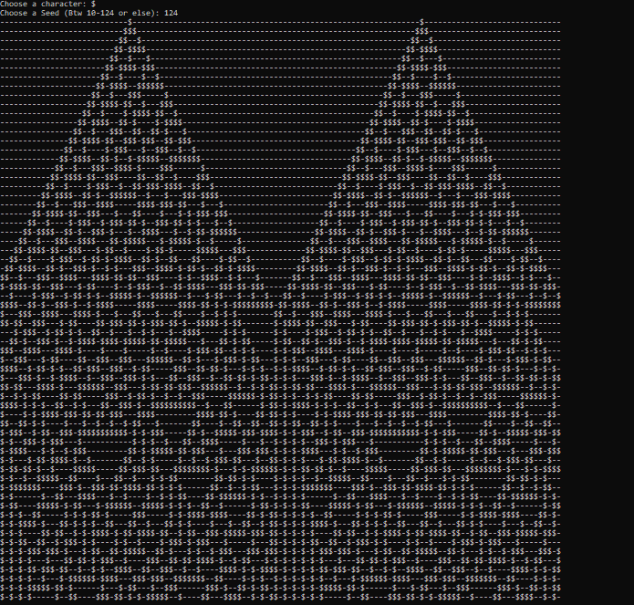

# Automata Rule30 in C++
### A little implementation of the Math&Computational Wolfram Theory of cellular Automata in C++<br>
*Run:* <br>
```
make -k && rule30
```
<br>
The program will asks you a character {can be also a number} for the cell representation and a number<br>
btw 24 to 124 (cool to see: 124) <br><br>
*Screenshot Example(windows):*<br>

